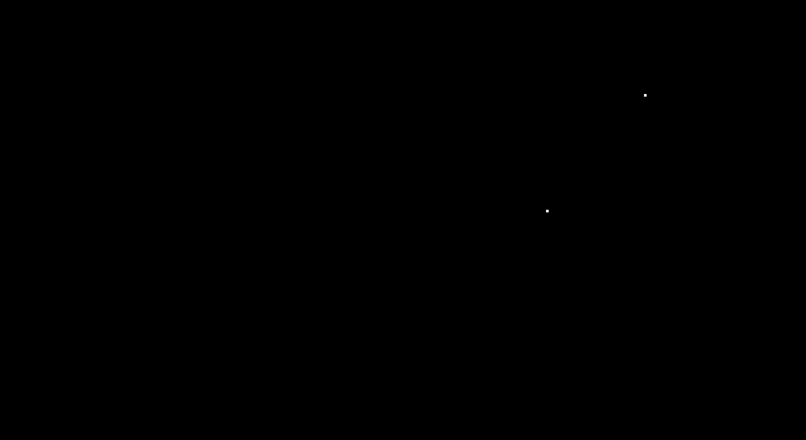

# OpenGL
This project is a "framework" I am building on to make it easy and convenient to
create increasingly complex simulations/scenes. 
The two main goals of this project are :
1. Help me learn modern OpenGL and the Maths behind Computer Graphics 
2. Simulate cool looking stuff

Things it can do: 

